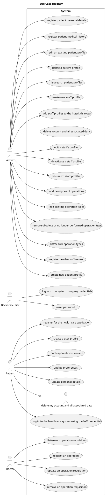
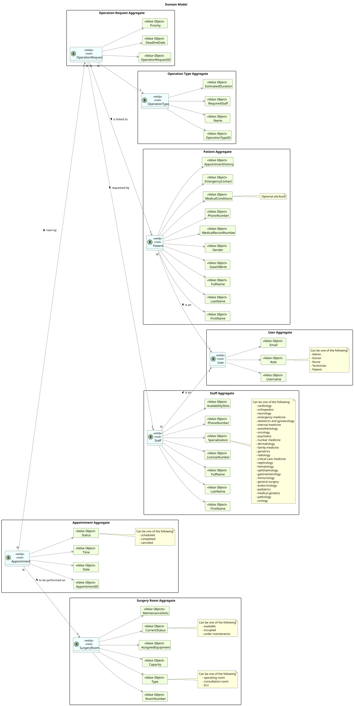

# Sprint A

## 1. Use Cases

------------------------------------

### 1.1. Use Case Diagram

### 1.2. Use Cases

| **Use_Cases** | **Description** |
|:-------------:|:---------------:|
|               |                 |
|               |                 |

## 2. Domain Model

---------------------------------

The Domain Model represents the essential concepts, entities, aggregates, and their relationships within the project's domain.

### 2.1. Introduction

The domain model serves as a conceptual blueprint of the project's domain. It helps to understand the key entities, their attributes, and relationships, facilitating effective communication and development.

### 2.2. Project Structure

The domain model is structured using UML notation. It consists of entities, aggregates, value objects, and associations between them.

### 2.3. Entities and Aggregates

#### Entities

#### Associations

### 2.5. Domain Model

## 3. Glossary

----------------------------------

[Glossary](glossary.md)

## 4. Supplementary Specification

----------------------------------

[FURPS+](supplementary-specifications.md)