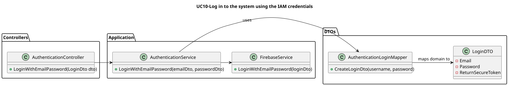

# UC10 - Log in to the system using the IAM credentials

-----------------------------------------------------------------------

## Contents

1. [Use Case Description](#1-use-case-description)
2. [Customer Specifications and Clarifications](#2-customer-specifications-and-clarifications)
3. [Diagrams](#3-diagrams)
    - [Level 1](#level-1)
        - [Process View](#process-view)
    - [Level 2](#level-2)
        - [Process View](#process-view-1)
    - [Level 3](#level-3)
        - [Process View](#process-view-2)
            - [Backend Process View](#backend-process-view)
            - [Class Diagram](#class-diagram)
4. [Acceptance Criteria and Tests](#4-acceptance-criteria-and-tests)
5. [Dependencies](#5-dependencies)
6. [Definition of Ready (DoR)](#6-definition-of-ready-dor)
    - [6.1. Clear and Detailed Description](#61-clear-and-detailed-description)
    - [6.2. Acceptance Criteria](#62-acceptance-criteria)
    - [6.3. Dependencies and Resources](#63-dependencies-and-resources)
    - [6.4. Estimation and Sizing](#64-estimation-and-sizing)
7. [Definition of Done (DoD)](#7-definition-of-done-dod)
    - [7.1. Code Quality](#71-code-quality)
    - [7.2. Testing](#72-testing)
    - [7.3. Documentation](#73-documentation)

-----------------------------------------------------------------------

## 1. Use Case Description

-------------------------------------------------------------------------

As a Patient, I want to log in to the healthcare system using my external IAM
credentials.

## 2. Customer Specifications and Clarifications

--------------------------------------------------------------------------

**Question**: Do we always need to create an associated user when recording a patient profile in a medical facility?

**Answer**: No. A patient profile can be created without an associated user unless it's easier technically to create an inactive user.

**Question**: In IAM external system, if a patient is signed in with a google account and later uses other external system like Facebook, and both have different credentials, what happens?

**Answer**: assume the system only supports one IAM

**Question**: Chapter 3.2 says that "Backoffice users are registered by the admin in the IAM through an out-of-band process.", but US 5.1.1 says that "Backoffice users are registered by an Admin via an internal process, not via self-registration.".
Can you please clarify if backoffice users registration uses the IAM system? And if the IAM system is the out-of-band process?

**Answer**: what this means is that backoffice users can not self-register in the system like the patients do. the admin must register the backoffice user. If you are using an external IAM (e.g., Google, Azzure, Linkedin, ...) the backoffice user must first create their account in the IAM provider and then pass the credential info to the admin so that the user account in the system is "linked" wit the external identity provider.
 

## 3. Diagrams

---------------------------------------------------------------------------

### Level 1

#### Process View

### Level 2

#### Process View

### Level 3

##### Backend Process View

##### Class Diagram

## 4. Acceptance Criteria and Tests

---------------------------------------------------------------------------

To successfully implement this use case, the following criteria must be met:

- Patients log in via an external Identity and Access Management (IAM) provider (e.g., Google,
  Facebook, or hospital SSO).
- After successful authentication via the IAM, patients are redirected to the healthcare system
  with a valid session.
- Sessions expire after a defined period of inactivity, requiring re-authentication.

## 5. Dependencies

-----------------------------------------------------------------------------

This use case relies on the following API functionalities:

        DELETE /Patients/GDPR/{id}

## 6. Definition of Ready (DoR)

------------------------------------------------------------------------------

### 6.1. Clear and Detailed Description

The use case is deemed ready when the requirements are clearly outlined, providing a comprehensive
understanding of the functionality to be implemented. Specifically, the user with the Patient role is expected to
possess the capability to log in to the healthcare system using his external IAM credentials.

### 6.2. Acceptance Criteria

The use case is considered ready when the acceptance criteria referenced in section 4 are clearly
defined. These criteria serve as the benchmark for determining the successful completion of the use case.

### 6.3. Dependencies and Resources

The use case is considered ready when all dependencies and resources required for its implementation
are identified. This includes the API functionalities necessary for the log in to the healthcare system using his external IAM credentials.

### 6.4. Estimation and Sizing

This use case is estimated to necessitate an allocation of approximately 16 to 24 hours (L Size) for completion.
This estimate is based on the complexity of the use case and the anticipated effort required for its
implementation.

## 7. Definition of Done (DoD)

---------------------------------------------------------------------------------

### 7.1. Code Quality

The use case is considered complete when the code quality meets the established standards. This
includes adherence to the coding conventions, the implementation of best practices, and the inclusion of
appropriate comments to enhance code readability and maintainability.

### 7.2. Testing

The use case is considered concluded when the implemented features are tested thoroughly. This
encompasses unit tests, integration tests, and end-to-end tests to ensure the functionality operates as
expected. Additionally, the use case is considered complete when the implemented features are
validated against the acceptance criteria outlined in section 4.

### 7.3. Documentation

The use case is considered finalized when the documentation is updated to reflect the changes
introduced by the implementation. This includes updating the relevant diagrams, README files, and any
other documentation to ensure it accurately represents the current state of the system.

## 8. GDPR Compliance

-----------------------------------------------------------------------

This section outlines the relevant GDPR articles pertaining to the patient's right to delete their account and associated data, as well as the specific implementation requirements to ensure compliance with these regulations.

### 8.1. Relevant GDPR Articles

**Article 17:** Right to Erasure ("Right to be Forgotten")

        Patients have the right to request the deletion of their personal data when it is no longer necessary for the purposes for which it was collected, or when they withdraw consent.

**Article 7:** Conditions for Consent

         Patients must be informed about their right to withdraw consent at any time and how it affects their personal data, including the account deletion process.

**Article 12:** Transparent Information, Communication, and Modalities for the Exercise of the Rights of the Data Subject

         Patients must be provided with clear and transparent information regarding the procedures for account deletion and the time frame within which their data will be erased.

**Article 15:** Right of Access by the Data Subject

        Patients can request access to their personal data and receive information about how it is processed before requesting deletion.

**Article 30:** Records of Processing Activities

The system must maintain records of processing activities, including actions taken regarding account deletion, to demonstrate compliance.

### 8.2. Implementation Requirements

To ensure compliance with the GDPR requirements regarding account deletion, the following criteria must be met:

- **Account Deletion Request:** Patients can request to delete their account through the profile settings.

- **Confirmation Email:** The system must send a confirmation email to the patient before proceeding with account deletion. This email should clearly explain the consequences of account deletion and confirm the patient's intention.

- **Deletion Time Frame:** Upon confirmation of the deletion request, all personal data must be permanently deleted from the system within the legally required time frame (e.g., 30 days).

- **Notification of Completion:** Patients should be notified once the deletion process is complete. This notification should also inform them of any data that may be retained in an anonymized format.

- **Retention of Anonymized Data:** Certain anonymized data may be retained for legal or research purposes, but all identifiable information must be erased. The anonymized data should be as follows:

      Patient Name: "Anonymous"
      Birth Date: "1900-01-01"
      Gender: "Unspecified"
      Patient ID: patient.Id
      Phone Number: "000-000-0000"
      Medical Conditions: new List<MedicalConditions>()
      Emergency Contact: "000-000-0000"
      Appointment History: patient.AppointmentHistory
      User Email: "anonymous@domain.com"
    
- **Logging of Deletion Action:** The system must log the deletion action for GDPR compliance, including details about the request and the completed action.

