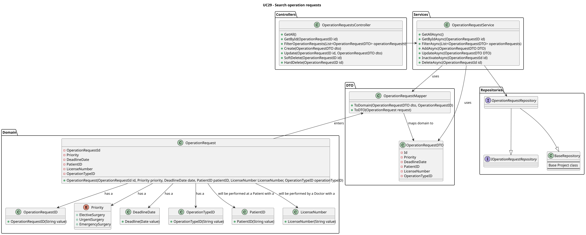

# UC34 - Search operation requisitions

-----------------------------------------------------------------------

## Contents

1. [Use Case Description](#1-use-case-description)
2. [Customer Specifications and Clarifications](#2-customer-specifications-and-clarifications)
3. [Diagrams](#3-diagrams)
    - [Level 1](#level-1)
        - [Process View](#process-view)
    - [Level 2](#level-2)
        - [Process View](#process-view-1)
    - [Level 3](#level-3)
        - [Process View](#process-view-2)
            - [Backend Process View](#backend-process-view)
            - [Class Diagram](#class-diagram)
4. [Acceptance Criteria and Tests](#4-acceptance-criteria-and-tests)
5. [Dependencies](#5-dependencies)
6. [Definition of Ready (DoR)](#6-definition-of-ready-dor)
    - [6.1. Clear and Detailed Description](#61-clear-and-detailed-description)
    - [6.2. Acceptance Criteria](#62-acceptance-criteria)
    - [6.3. Dependencies and Resources](#63-dependencies-and-resources)
    - [6.4. Estimation and Sizing](#64-estimation-and-sizing)
7. [Definition of Done (DoD)](#7-definition-of-done-dod)
    - [7.1. Code Quality](#71-code-quality)
    - [7.2. Testing](#72-testing)
    - [7.3. Documentation](#73-documentation)

-----------------------------------------------------------------------

## 1. Use Case Description

-------------------------------------------------------------------------

As a Doctor, I want to search operation requisitions.

## 2. Customer Specifications and Clarifications

--------------------------------------------------------------------------

**Q:** How does a Doctor suggests a deadline date for an appointment? Does it have any criteria? Or do they just wing it?

**A:** the doctor will decide the "best" due date based on their experience. they will enter it in the system as an indication so that the planning module eventually takes that into account alongside priority and other criteria.

**Q:** In the project document it mentions that each operation has a priority. How is a operation's priority defined? Do they have priority levels defined? Is it a scale? Or any other system?

**A:** Elective Surgery: A planned procedure that is not life-threatening and can be scheduled at a convenient time (e.g., joint replacement, cataract surgery).
Urgent Surgery: Needs to be done sooner but is not an immediate emergency. Typically within days (e.g., certain types of cancer surgeries).
Emergency Surgery: Needs immediate intervention to save life, limb, or function. Typically performed within hours (e.g., ruptured aneurysm, trauma).

**Q:** When does an operation request become an appointment?

**A:** when it is scheduled by the planning/scheduling module.

## 3. Diagrams

---------------------------------------------------------------------------

### Level 1

#### Process 

### Level 2

#### Process View

### Level 3

#### Process View

##### Backend Process View

##### Class Diagram

## 4. Acceptance Criteria and Tests

---------------------------------------------------------------------------

To successfully implement this use case, the following criteria must be met:

- Doctors can search operation requests by patient name, operation type, priority, and status.
- Each entry in the list includes operation request details (e.g., patient name, operation type,
  status).
- Doctors can select an operation request to view, update, or delete it.

## 5. Dependencies

-----------------------------------------------------------------------------

This use case relies on:

[1-register-backoffice-users](..%2F..%2F..%2F..%2F..%2Fdocs%2FSprintA%2F1-register-backoffice-users)

[12-create-a-new-staff-profile](..%2F..%2F..%2F..%2F..%2Fdocs%2FSprintA%2F12-create-a-new-staff-profile)

[13-create-patient-profile](..%2F..%2F..%2F..%2F..%2Fdocs%2FSprintA%2F13-create-patient-profile)

[21-add-staff-profile-hospital's-roster](..%2F..%2F..%2F..%2F..%2Fdocs%2FSprintA%2F21-add-staff-profile-hospital%27s-roster)

[30-request-an-operation](..%2F30-request-an-operation)

[37-add-new-operation-types](..%2F..%2F..%2F..%2F..%2Fdocs%2FSprintA%2F37-add-new-operation-types)

## 6. Definition of Ready (DoR)

------------------------------------------------------------------------------

### 6.1. Clear and Detailed Description

The use case is deemed ready when the requirements are clearly outlined, providing a comprehensive
understanding of the functionality to be implemented. Specifically, the user with the Doctor role is expected to
possess the capability to search operation requisitions.

### 6.2. Acceptance Criteria

The use case is considered ready when the acceptance criteria referenced in section 4 are clearly
defined. These criteria serve as the benchmark for determining the successful completion of the use case.

### 6.3. Dependencies and Resources

The use case is considered ready when all dependencies and resources required for its implementation
are identified. This includes the API functionalities necessary for the operation requisitions search.

### 6.4. Estimation and Sizing

This use case is estimated to necessitate an allocation of approximately 4 to 12 hours (M Size) for completion.
This estimate is based on the complexity of the use case and the anticipated effort required for its implementation.

## 7. Definition of Done (DoD)

---------------------------------------------------------------------------------

### 7.1. Code Quality

The use case is considered complete when the code quality meets the established standards. This
includes adherence to the coding conventions, the implementation of best practices, and the inclusion of
appropriate comments to enhance code readability and maintainability.

### 7.2. Testing

The use case is considered concluded when the implemented features are tested thoroughly. This
encompasses unit tests, integration tests, and end-to-end tests to ensure the functionality operates as
expected. Additionally, the use case is considered complete when the implemented features are
validated against the acceptance criteria outlined in section 4.

### 7.3. Documentation

The use case is considered finalized when the documentation is updated to reflect the changes
introduced by the implementation. This includes updating the relevant diagrams, README files, and any
other documentation to ensure it accurately represents the current state of the system.

