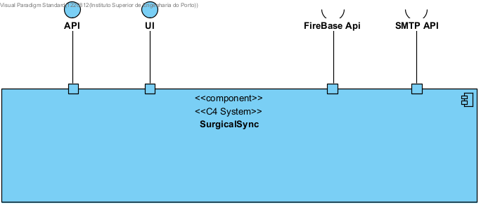
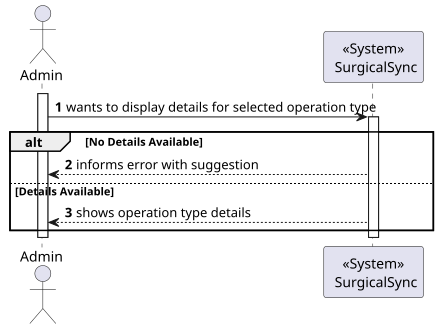
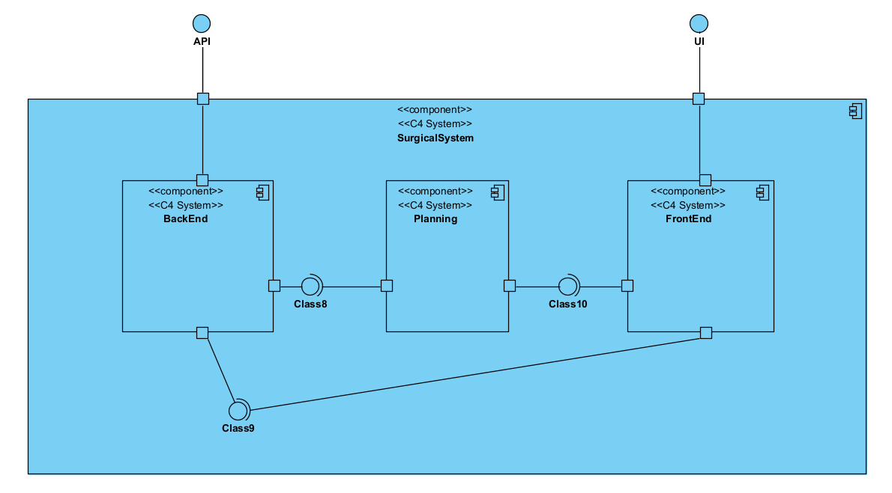
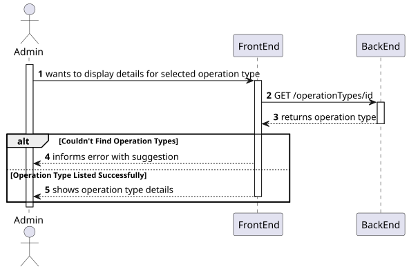
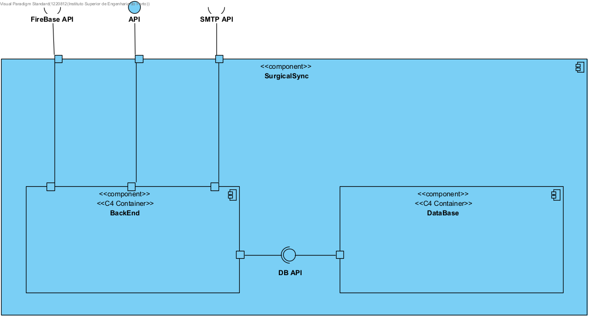
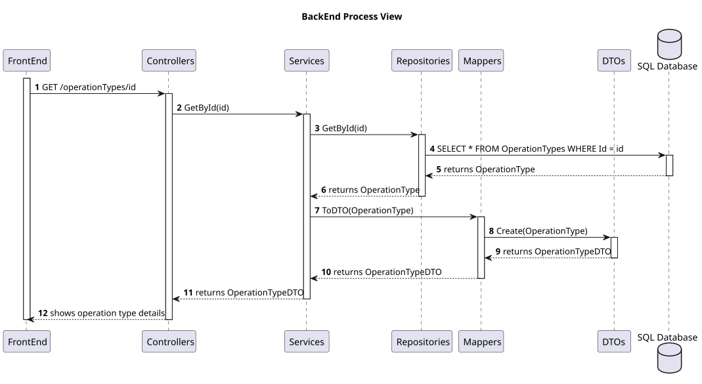
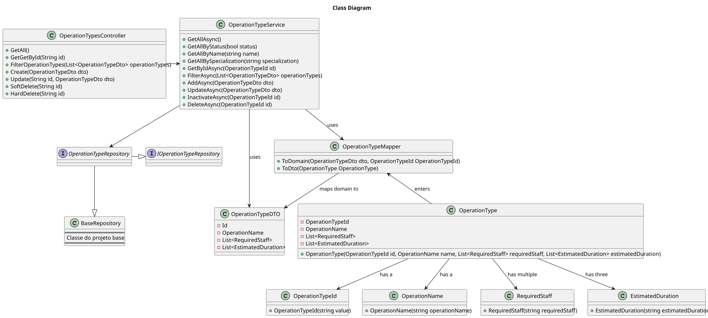

# Show Operation Type Details

## 1. Use Case Description

As an Admin, I want to view the details of an operation type so that I can access relevant information

## 2. Customer Specifications and Clarifications

The client has outlined that the Admin Role should possess the functionality to view the details of an operation type.

The following operation types are already available in the system:
- ACL Reconstruction Surgery
- Knee Replacement Surgery
- Shoulder Replacement Surgery
- Hip Replacement Surgery
- Meniscal Injury Treatment
- Rotator Cuff Repair
- Ankle Ligaments Reconstruction or Repair
- Lumbar Discectomy
- Trigger Finger
- Carpal Tunnel Syndrome

Once the Admin selects an operation type, they should be able to view the following details:
- ID
- Name
- Required Staff
- Estimated Duration

## 3. Diagrams

### Level 1

- Logical View


###
- Process View



### Level 2

- Logical View


###
- Process View



### Level 3

#### Logical Views

- BackEnd Logical View


#### Process Views

- BackEnd Process View


###
- FrontEnd Process View


###
- Class Diagram View



## 4. Acceptance Criteria and Tests

To successfully complete this user story, the following criteria must be met:

- Admins can search and filter operation types by name, specialization, or status
  (active/inactive).
- The system displays operation types in a searchable list with attributes such as name, required
  staff, and estimated duration.
- Admins can select an operation type to view, edit, or deactivate it.

## 5. Dependencies

This user story relies on the following API functionalities:

-   To update an operation type:
    ```
    GET /operationTypes/{id}
    ```

## 6. Definition of Ready (DoR)

### 6.1 Clear and Detailed Description

The user story is deemed ready when the requirements are clearly outlined, providing a comprehensive
understanding of the functionality to be implemented. Specifically, the Administrator role is expected to
possess the capability to register new backoffice users, designating their respective roles and
details such as their username and email address.

### 6.2 Acceptance Criteria

The user story is considered ready when the acceptance criteria referenced in section 4 are clearly
defined. These criteria serve as the benchmark for determining the successful completion of the user story.

### 6.3 Dependencies and Resources

The user story is considered ready when all dependencies and resources required for its implementation
are identified. This includes the API functionalities necessary for the creation of backoffice users.

### 6.4 Estimation and Sizing

This user story is estimated to necessitate an allocation of approximately 1 to 2 hours for completion.
This estimate is based on the complexity of the user story and the anticipated effort required for its
implementation.

## 7. Definition of Done (DoD)

### 7.1 Code Quality

The user story is considered complete when the code quality meets the established standards. This
includes adherence to the coding conventions, the implementation of best practices, and the inclusion of
appropriate comments to enhance code readability and maintainability.

### 7.2 Testing

The user story is considered concluded when the implemented features are tested thoroughly. This
encompasses unit tests, integration tests, and end-to-end tests to ensure the functionality operates as
expected. Additionally, the user story is considered complete when the implemented features are
validated against the acceptance criteria outlined in section 4.

### 7.3 Documentation

The user story is considered finalized when the documentation is updated to reflect the changes
introduced by the implementation. This includes updating the relevant diagrams, README files, and any
other documentation to ensure it accurately represents the current state of the system.