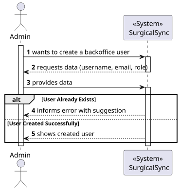
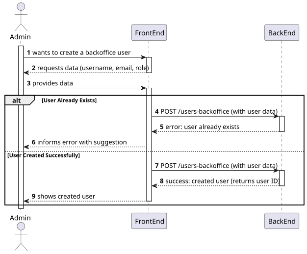
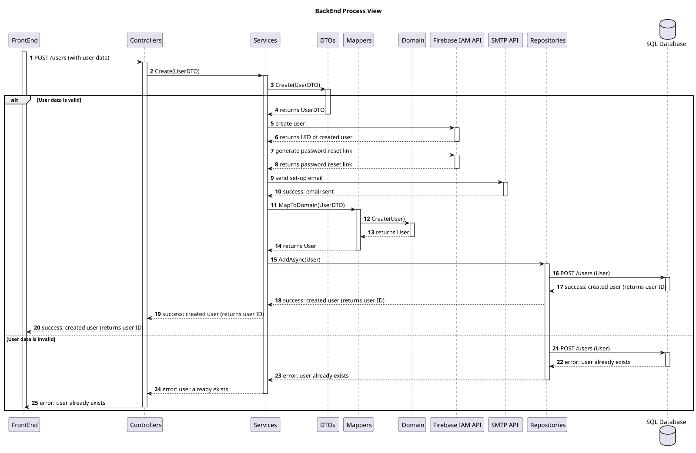

# Register New Backoffice Users

## 1. User Story Description

As an Admin, I want to register new backoffice users (e.g., doctors, nurses,
technicians, admins) via an out-of-band process, so that they can access the
backoffice system with appropriate permissions.

## 2. Customer Specifications and Clarifications

The client has outlined that the Admin Role should possess the functionality to create backoffice users through IAM.

The admin decides the role of the user, which can be one of the following:

- Doctor
- Nurse
- Technician

Attributes are :

- Username
- Email
- Role

The system enforces strong password requirements for security.

Registered users receive a one-time setup link via email to set their password and activate their
account.

A confirmation email is sent to verify the user’s registration

## 3. Diagrams

### Level 1

-   [Logical View](../global-artifacts/level1/logical-view.svg)


### Level 2

-   [Logical View](../global-artifacts/level2/logical-view.svg)


### Level 3

#### Logical Views

-   [MDR Logical View](../general-purpose/level3/mdr-logical-view.svg)
-   [UI Logical View](../general-purpose/level3/ui-logical-view.svg)

#### Implementation Views

-   [MDR Implementation View](./level3/mdr-implementation-view.svg)
-   [UI Implementation View](../general-purpose/level3/ui-implementation-view.svg)

#### Process Views


-   [SPA Process View](./level3/spa-process-view.svg)
-   [Class Diagram View](./level3/class-diagram.svg)

## 4. Acceptance Criteria and Tests

To successfully complete this user story, the following criteria must be met:

- Backoffice users (e.g., doctors, nurses, technicians) are registered by an Admin via an internal process, not via self-registration.
- Admin assigns roles (e.g., Doctor, Nurse, Technician) during the registration process.
- Registered users receive a one-time setup link via email to set their password and activate their account.
- The system enforces strong password requirements for security.
- A confirmation email is sent to verify the user’s registration.

## 5. Dependencies

This user story relies on the following API functionalities:

-   To create backoffice user
    ```
    POST /users-backoffice
    ```

## 6. Definition of Ready (DoR)

### 6.1 Clear and Detailed Description

The user story is deemed ready when the requirements are clearly outlined, providing a comprehensive
understanding of the functionality to be implemented. Specifically, the Administrator role is expected to 
possess the capability to register new backoffice users, designating their respective roles and
details such as their username and email address.

### 6.2 Acceptance Criteria

The user story is considered ready when the acceptance criteria referenced in section 4 are clearly
defined. These criteria serve as the benchmark for determining the successful completion of the user story.

### 6.3 Dependencies and Resources

The user story is considered ready when all dependencies and resources required for its implementation
are identified. This includes the API functionalities necessary for the creation of backoffice users.

### 6.4 Estimation and Sizing

This user story is estimated to necessitate an allocation of approximately 4 to 12 hours for completion.
This estimate is based on the complexity of the user story and the anticipated effort required for its
implementation.

## 7. Definition of Done (DoD)

### 7.1 Code Quality

The user story is considered complete when the code quality meets the established standards. This
includes adherence to the coding conventions, the implementation of best practices, and the inclusion of
appropriate comments to enhance code readability and maintainability.

### 7.2 Testing

The user story is considered concluded when the implemented features are tested thoroughly. This
encompasses unit tests, integration tests, and end-to-end tests to ensure the functionality operates as
expected. Additionally, the user story is considered complete when the implemented features are
validated against the acceptance criteria outlined in section 4.

### 7.3 Documentation

The user story is considered finalized when the documentation is updated to reflect the changes
introduced by the implementation. This includes updating the relevant diagrams, README files, and any
other documentation to ensure it accurately represents the current state of the system.

