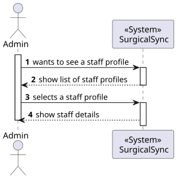
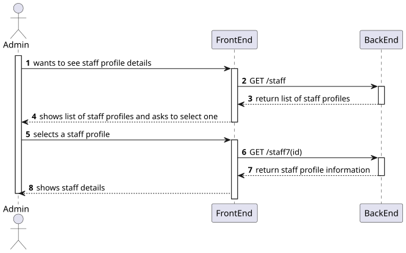
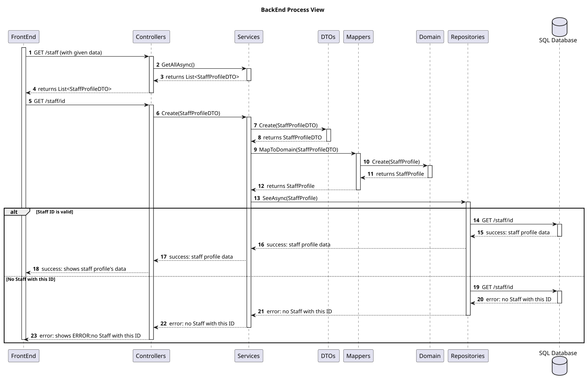
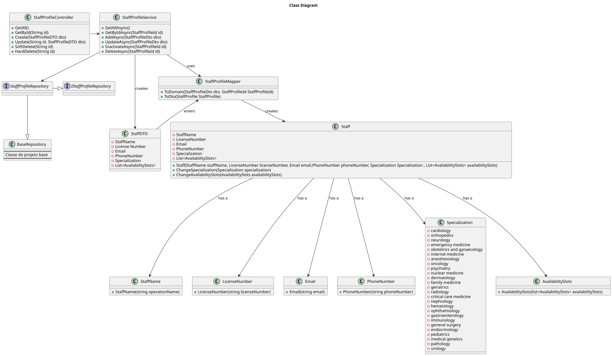

# See a staff profile's details.

## 1. Use Case Description

As an Admin, I want to see a staff’s profile details.

## 2. Customer Specifications and Clarifications


The client has outlined that the Admin Role should possess the functionality to see a staff profile's details.


## 3. Diagrams

### Level 1

###
- Process View



### Level 2

###
- Process View



### Level 3


#### Process Views

- BackEnd Process View



###
- Class Diagram View



## 4. Acceptance Criteria and Tests

    - The system displays search results in a list view with key staff information (name, email,
    specialization).
    - Admins can select a profile from the list to view, edit, or deactivate.
    - The search results are paginated, and filters are available for refining the search results.

## 5. Dependencies

This user story relies on the following API functionalities:

-   To see a staff profile's details:
    ```
    GET /staff
    ```

## 6. Definition of Ready (DoR)

### 6.1 Clear and Detailed Description

The user story is deemed ready when the requirements are clearly outlined, providing a comprehensive
understanding of the functionality to be implemented. Specifically, the Administrator role is expected to
possess the capability to edit a staff profile, updating details such as their availability slots and specialization.

### 6.2 Acceptance Criteria

The user story is considered ready when the acceptance criteria referenced in section 4 are clearly
defined. These criteria serve as the benchmark for determining the successful completion of the user story.

### 6.3 Dependencies and Resources

The user story is considered ready when all dependencies and resources required for its implementation
are identified. This includes the API functionalities necessary for the visualization of staff profile's details.

### 6.4 Estimation and Sizing

This user story is estimated to necessitate an allocation of approximately 7 to 8 hours for completion.
This estimate is based on the complexity of the user story and the anticipated effort required for its
implementation.

## 7. Definition of Done (DoD)

### 7.1 Code Quality

The user story is considered complete when the code quality meets the established standards. This
includes adherence to the coding conventions, the implementation of best practices, and the inclusion of
appropriate comments to enhance code readability and maintainability.

### 7.2 Testing

The user story is considered concluded when the implemented features are tested thoroughly. This
encompasses unit tests, integration tests, and end-to-end tests to ensure the functionality operates as
expected. Additionally, the user story is considered complete when the implemented features are
validated against the acceptance criteria outlined in section 4.

### 7.3 Documentation

The user story is considered finalized when the documentation is updated to reflect the changes
introduced by the implementation. This includes updating the relevant diagrams, README files, and any
other documentation to ensure it accurately represents the current state of the system.